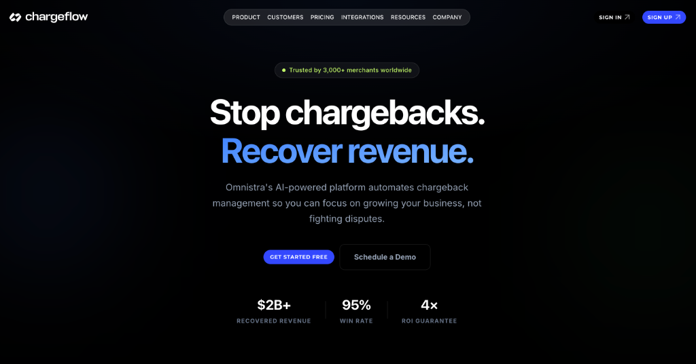
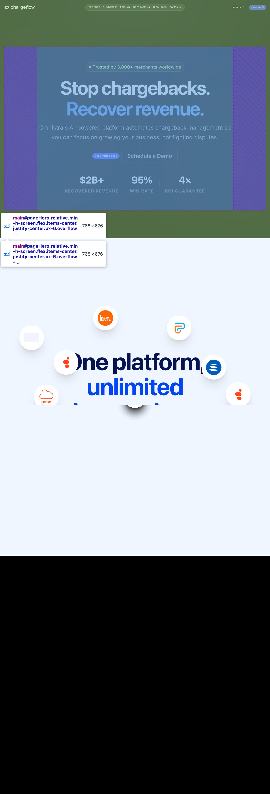
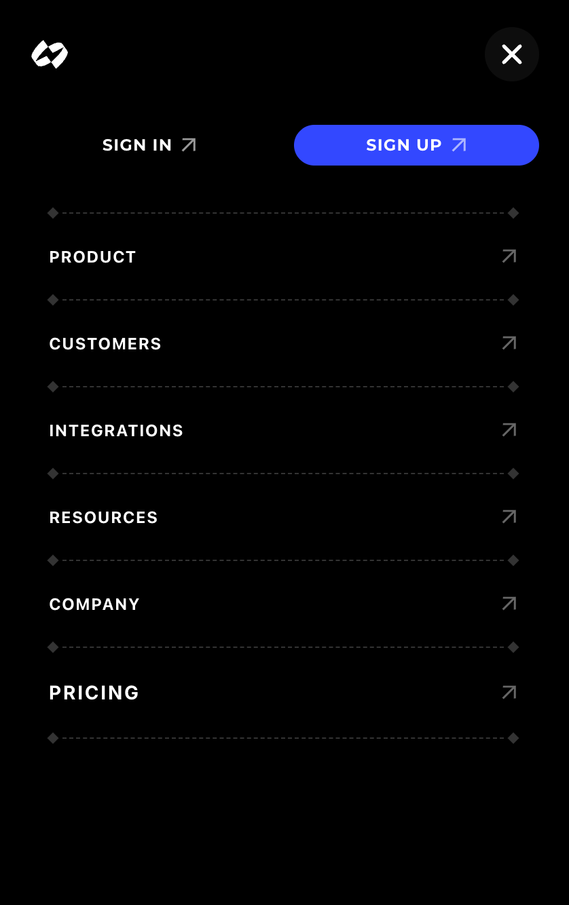
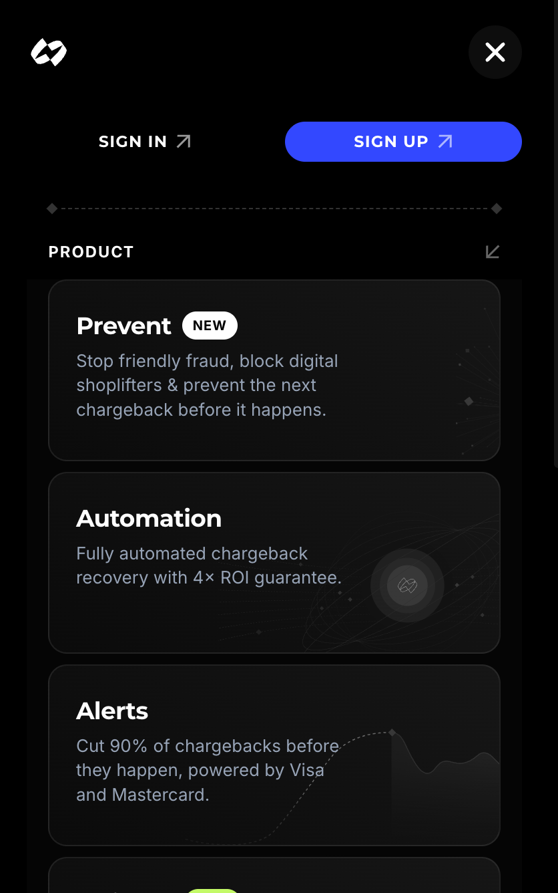

# Omnistra Dashboard - Integration Task

A high-fidelity implementation of the Omnistra Integrations section and dynamic navigation system, built using **React 19**, **Vite**, and **Framer Motion**.

## 🚀 Live Demo & Repository

- **GitHub Repository:** [https://github.com/anamul01988/omnistra-task](https://github.com/anamul01988/omnistra-task)

---

## 🛠️ Tech Stack

- **Framework:** React 19
- **Build Tool:** Vite
- **Styling:** Tailwind CSS 4
- **Animations:** Framer Motion (Figma-accurate scroll transforms)
- **Icons:** SVG-based for maximum sharpness and performance

---

## ⚙️ Setup & Run Instructions

### 1. Local Installation

Clone the repository and install dependencies:

```bash
git clone https://github.com/anamul01988/omnistra-task.git
cd omnistra-task
npm install
```

### 2. Development Command

Start the local development server:

```bash
npm run dev
```

The application will be available at `http://localhost:5173`.

### 3. Build Command

Generate a production-ready bundle:

```bash
npm run build
```

The output will be in the `dist/` folder.

---

## 🏗️ Code Quality & Architecture

This project was built with a focus on maintainability, performance, and high-fidelity aesthetics. Here’s how the review criteria were addressed:

### 📂 Folder Structure

- **`src/components/layout`**: Persistent UI elements like `Navbar` and `MobileMenu`.
- **`src/components/sections`**: Page-level sections such as `Hero` and `IntegrationsSection`.
- **`src/components/ui`**: Atomic, reusable components (e.g., `Logo`, `NavTag`, `ArrowIcon`).
- **`src/components/dropdowns`**: Complex navigation dropdowns separated for clarity.
- **`src/data`**: Centralized configuration files for navigation and integration data, ensuring a "data-driven" UI.

### 🧩 Component Architecture

- **Composition over Inheritance**: Used component composition (e.g., `DropdownShell`) to wrap varied content while maintaining consistent animation and styling logic.
- **Dumb vs. Smart Components**: Sections handle logic (scroll tracking, state), while UI components focus on presentation.

### ♻️ Reusability

- **Dynamic Theming**: The `isLight` prop is propagated through the component tree, allowing the entire navigation system to flip themes based on the background.
- **Utility Components**: Standardized elements like `ArrowIcon` and `NavTag` are used across both Desktop and Mobile views.

### 🧹 Clean Code Practices

- **ES6+ Standards**: Extensive use of destructuring, arrow functions, and modern JavaScript features.
- **Prop Logic**: Used descriptive prop names and avoided "prop drilling" by keeping state localized or using composition.
- **CSS-in-JS (Tailwind)**: Leveraged Tailwind 4 for utility-first styling, combined with CSS variables for complex properties like custom `@property` laser animations.

### 🏷️ Naming Conventions

- **PascalCase** for components and files.
- **camelCase** for variables, functions, and props.
- **BEM-inspired** class names for custom CSS in `index.css` (e.g., `.btn-premium--primary`).

### ⚡ Performance Considerations

- **`useCallback` & `useMemo`**: Utilized to prevent unnecessary re-renders in the `Navbar` and complex list renderings.
- **Passive Listeners**: Scroll listeners are marked as `{ passive: true }` to avoid blocking the main thread.
- **SVG Optimization**: All icons are inline SVGs, reducing HTTP requests and ensuring infinite scalability.

### 📱 Responsiveness Strategy

- **`distanceFactor`**: A dynamic multiplier that scales the Integration Section's animation based on the viewport width.
- **Fluid Typography**: Used `clamp()` and `vw` units for headings to ensure content fits perfectly on everything from an iPhone SE to a Pro Display XDR.
- **Custom Breakpoints**: Tailored Tailwind breakpoints to handle intermediate states between mobile and desktop gracefully.

---

## 🧠 Implementation Assumptions

1.  **Scroll Intent**: I assumed that the convergence animation should feel like a "reward" for scrolling, so it is synchronized with the natural scroll speed using `framer-motion` springs.
2.  **Navigation Density**: Assumed that "Schedule a Demo" is the primary CTA when the navbar is in its "pill" state, prioritizing conversion.
3.  **Font Substitution**: While the original design called for **Helvetica**, it was replaced with **Montserrat** (for headings/buttons) and **Inter** (for body/nav items) to ensure the project remains open-source friendly while maintaining a similar premium geometric aesthetic.
4.  **Color Space**: Used the P3 color-compatible hex codes from the reference to ensure colors pop on modern displays.

---

## 📸 Screenshots

### Desktop & Tablet Views

| Desktop Hero                                           | Tablet View                                       | Integration Animation                                                   |
| :----------------------------------------------------- | :------------------------------------------------ | :---------------------------------------------------------------------- |
|  |  |  |

### Mobile Navigation

| Mobile Menu                                                 | Product Sub-menu                                                                   |
| :---------------------------------------------------------- | :--------------------------------------------------------------------------------- |
|  |  |

> [!TIP]
> **Pro Tip:** Try scrolling slowly through the Integrations section to see the "spring" physics in action!

---

### Submitted by: Anamul Haque
